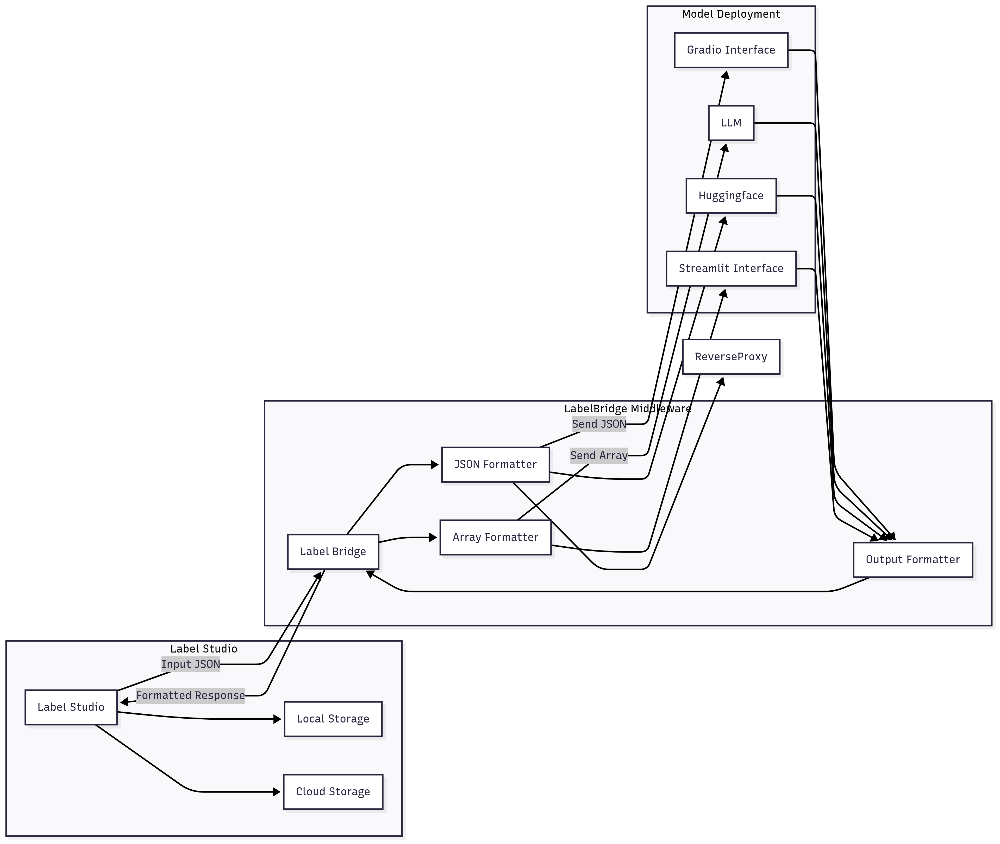

# Getting Started with LabelBridge

This section will guide you through the process of setting up LabelBridge and provide a high-level overview of how it functions within your annotation pipeline.

## Installation

Getting LabelBridge up and running is straightforward. Follow these steps to prepare your environment and install the necessary components.

{: .note }
Make sure you have **Python 3.9+** installed on your system.

### Installation Steps

- **Clone the Repository:** Start by cloning the LabelBridge repository from GitHub to your local machine:

    ```bash
    git clone https://github.com/Partha11/flask-proxy
    cd flask-proxy
    ```
- **Create a Virtual Environment (Recommended):** It's highly recommended to use a virtual environment to manage project dependencies and avoid conflicts with other Python projects.

    ```bash
    python3 -m venv .venv
    source .venv/bin/activate  # Or use .\venv\Scripts\activate on Windows
    ```

- **Install Dependencies:** Navigate to the project directory and install the required dependencies using pip:

    ```bash
    pip install -r requirements.txt
    ```

After installation, you should have a working environment for LabelBridge. Set your environment variables, such as your Hugging Face Space URL and token in the `.env` file.

{: .highlight }
You can use Anaconda to create a virtual environment and configure the middleware.

## How LabelBridge Works?

LabelBridge operates as a crucial intermediary, translating communication between Label Studio and your backend ML/LLM services. Its core function is to ensure data compatibility, allowing seamless automated annotation.

Conceptually, the process flows as follows:

- Label Studio sends a request for predictions: When Label Studio needs predictions (e.g., for pre-annotation or model-assisted labeling), it sends a POST request to LabelBridge.
- LabelBridge intercepts and transforms: LabelBridge receives this request. It then applies pre-defined logic to parse Label Studio's (often undocumented) JSON payload and transforms it into a clean, standardized format that your NLP model or LLM expects.
- Data sent to your ML/LLM service: The transformed data is then forwarded to your designated NLP model or LLM endpoint.
- Prediction received from ML/LLM service: Your model processes the data and returns a prediction in its native output format.
- LabelBridge transforms and responds to Label Studio: LabelBridge receives the model's prediction, transforms it back into the specific JSON format that Label Studio expects for annotations, and sends this response back to Label Studio.

This transparent translation layer means you only need to configure LabelBridge once to handle the complexities of data interchange.

### Architectural Flow

Below is a simplified diagram illustrating the high-level data flow. A more detailed architectural breakdown will be provided in the "Architecture" section.

<p align="center">
  
</p>

This diagram highlights how LabelBridge abstracts away the complexities of data formatting, allowing your Label Studio and ML/LLM services to communicate effortlessly. In the following sections, we'll dive deeper into specific configurations and practical examples to get your automated annotation pipeline running smoothly.