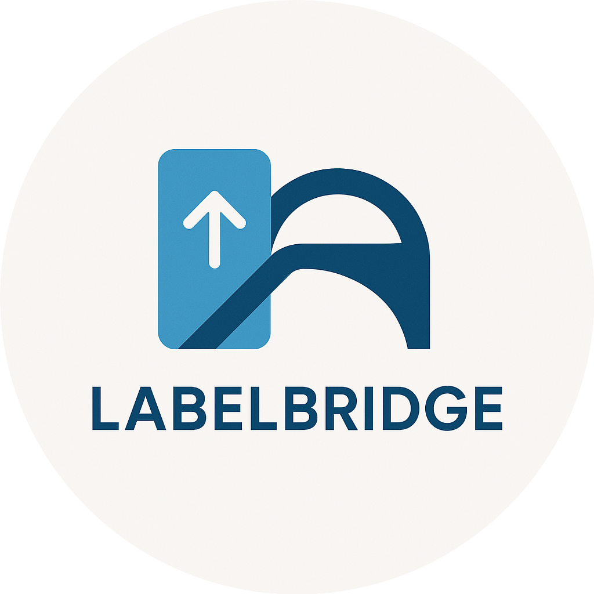

<p align="center">
  
</p>

<h1 align="center">LabelBridge</h1>

<p align="center">
  A Flask-based proxy to connect Label Studio with NLP models and LLMs <br />
  Automatically handles undocumented request/response formatting for smooth automated annotation.
</p>

<p align="center">
  <a href="https://www.python.org/downloads/release/python-390">
    
  </a>
  <a href="https://flask.palletsprojects.com/en/3.0.x/">
    
  </a>
  <a href="https://github.com/Partha11/flask-proxy/issues">
    
  </a>
</p>

## Overview

**LabelBridge** is a lightweight Flask middleware that enables seamless integration between [Label Studio](https://labelstud.io/) and your NLP/LLM models. It was built to overcome the lack of documentation around automated annotation input/output formats in Label Studio.

By acting as an intelligent proxy, LabelBridge:
- Intercepts requests from Label Studio
- Reformats them into the format your NLP/LLM expects
- Forwards predictions back in a structure Label Studio understands

Originally designed for Named Entity Recognition (NER) via Hugging Face Spaces, the middleware is flexible and extendable for broader use cases in text-processing tasks.

## How It Works

1. Label Studio sends a model request to the Flask proxy.
2. LabelBridge reformats the request to match the structure required by your model (e.g., Hugging Face Space).
3. The model processes the request and returns a prediction.
4. LabelBridge transforms the prediction into the format expected by Label Studio.

## Installation

- Clone the repository:

    ```bash
    git clone https://github.com/Partha11/flask-proxy
    cd flask-proxy
    ```

- Create and activate a virtual environment:

    ```bash
    python3 -m venv .venv
    source .venv/bin/activate  # Or use .\venv\Scripts\activate on Windows
    ```

- Install dependencies:

    ```bash
    pip install -r requirements.txt
    ```

## Configuration
Copy the environment template:

```bash
cp .env.example .env
```

Add your Hugging Face Space URL and token to the .env file.

## Usage

To start the server:

```python
python -m src.main
```

By default, the server listens at the /predict endpoint. To learn how to connect it with Label Studio, refer to the [Wiki][wiki-url].

## Features

- Seamless Label Studio to NLP Model communication
- Automatic input/output reformatting
- Supports Hugging Face Spaces & custom NLP/LLM models
- Built for text-based labeling tasks (NER, classification, etc.)

## Roadmap

- [x] Add LLM prediction support
- [x] Add health check endpoint
- [ ] Externalize Label Studio config for better flexibility

## Contributing

Contributions are welcome. Please follow the 

- Fork the repository
- Create a feature branch: git checkout -b feature/your-feature
- Commit your changes: git commit -am 'Add feature'
- Push to the branch: git push origin feature/your-feature
- Open a Pull Request

## License

This project is open-source and distributed under the MIT License.

<!-- Links -->
[wiki-url]: https://partha11.github.io/flask-proxy/